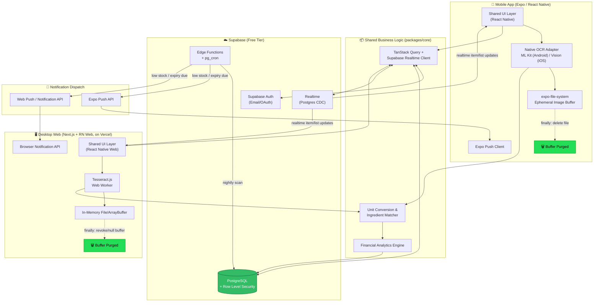
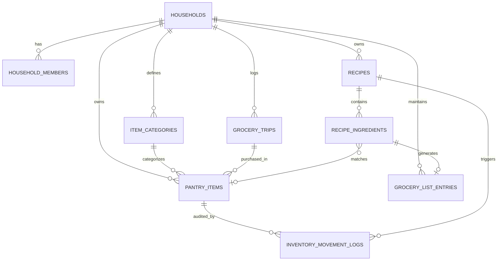

# Smart Household Pantry & Budget Tracker
## System Architecture & Functional Specification

**Target Market:** Philippine Households
**Platforms:** iOS, Android, Desktop Web (Chrome/Safari/Edge/Firefox)
**Operational Cost Target:** ₱0/month at low-to-moderate household scale
**Document Status:** Build-ready v1.0

---

## Table of Contents

1. [System Overview & Multi-Surface Architecture](#1-system-overview--multi-surface-architecture)
2. [Database Schema & Data Models](#2-database-schema--data-models)
3. [Core Processing Pipelines & Algorithms](#3-core-processing-pipelines--algorithms)
4. [Responsive Desktop & Mobile UX Hierarchy](#4-responsive-desktop--mobile-ux-hierarchy)
5. [Supabase Row Level Security (RLS) Policies](#5-supabase-row-level-security-rls-policies)
6. [Non-Functional & Data Retention Policies](#6-non-functional--data-retention-policies)

---

## 1. System Overview & Multi-Surface Architecture

### 1.1 Design Philosophy

A single React codebase (React Native + React Native Web) drives three deployment targets — iOS, Android, and Desktop Web — sharing 100% of business logic, state management (Zustand/Redux + TanStack Query), and Supabase client calls. Platform divergence is isolated to two concerns only: **OCR engine** (native ML Kit/Vision vs. Tesseract.js) and **file/image buffer handling** (`expo-file-system` vs. browser `File`/`ArrayBuffer`), both abstracted behind a common `IOcrProvider` interface so upstream UI and matching logic never branch on platform.

### 1.2 Monorepo Structure

```
pantry-tracker/
├── apps/
│   ├── mobile/              # Expo Managed Workflow (iOS + Android)
│   └── web/                 # Next.js (React Native Web compiled)
├── packages/
│   ├── ui/                  # Shared RN/RNW components
│   ├── core/                # Business logic: matching, conversion, analytics
│   ├── ocr/                 # IOcrProvider + platform adapters
│   │   ├── ocr.native.ts    # ML Kit / Apple Vision
│   │   └── ocr.web.ts       # Tesseract.js Web Worker
│   ├── supabase-client/     # Typed Supabase client + generated types
│   └── notifications/       # Expo Push + Web Notifications adapter
└── supabase/
    ├── migrations/          # SQL DDL + RLS
    └── functions/           # Edge Functions (expiry cron, notification dispatch)
```

### 1.3 Zero-Cost Infrastructure Map

| Layer | Provider | Free Tier Ceiling | Notes |
|---|---|---|---|
| Desktop hosting | Vercel Hobby | 100 GB bandwidth/mo | Auto-SSL, custom domain |
| Mobile distribution | Expo EAS (free tier) | Limited monthly builds | OTA updates via `expo-updates` |
| Database + Auth | Supabase Free | 500 MB DB, 50k MAU, 2 GB egress | Realtime included |
| Scheduled jobs | Supabase Edge Functions + `pg_cron` | 500K invocations/mo | Drives expiry monitor |
| Push notifications | Expo Push API | Unlimited (rate-limited) | No cost tier |
| Web notifications | Browser Notification API | N/A — client-side only | Requires PWA service worker |
| OCR | On-device (ML Kit/Vision) + Tesseract.js (WASM, in-browser) | N/A — no API calls | Zero cloud inference cost |

### 1.4 Architecture Diagram



### 1.5 Data Flow Summary

1. **Capture** — user photographs a recipe (mobile) or drops an image/pastes text (web).
2. **Extract** — platform-native OCR converts image → raw text entirely in local memory; no network call.
3. **Purge** — the image buffer/file handle is destroyed in a `finally` block regardless of OCR success/failure (Section 3.1).
4. **Match** — `packages/core` parses ingredient lines, normalizes units, and diffs against the household's live pantry stock (fetched via Supabase, cached via TanStack Query).
5. **Sync** — any resulting stock deductions, grocery list additions, or new pantry items are written to Postgres and broadcast to all household devices via Supabase Realtime.
6. **Notify** — `pg_cron`-triggered Edge Functions scan for expiry/low-stock conditions nightly and dispatch via Expo Push (mobile) or Web Push (desktop PWA).

---

## 2. Database Schema & Data Models

### 2.1 Design Notes

- All monetary columns use `NUMERIC(12, 2)` — sufficient for household-scale PHP amounts (up to ₱9,999,999,999.99) with exact decimal arithmetic (never `FLOAT`/`REAL` for currency).
- All tables carry `household_id` for RLS scoping (Section 5).
- `uuid` primary keys via `gen_random_uuid()` (pgcrypto, enabled by default on Supabase).
- Soft categorization: `item_categories` is household-extensible, seeded with defaults on household creation.

### 2.2 Full DDL Script

```sql
-- =========================================================
-- EXTENSIONS
-- =========================================================
create extension if not exists "pgcrypto";
create extension if not exists "pg_cron";

-- =========================================================
-- ENUM TYPES
-- =========================================================
create type household_role as enum ('OWNER', 'ADMIN', 'MEMBER');

create type storage_location as enum ('FRIDGE', 'FREEZER', 'PANTRY', 'COUNTER', 'OTHER');

create type unit_of_measure as enum (
  'kg', 'g', 'lbs', 'pcs', 'packs', 'tbsp', 'tsp', 'ml', 'L', 'cups', 'stick', 'oz'
);

create type movement_event_type as enum (
  'PURCHASED', 'CONSUMED', 'EXPIRED', 'SPOILED_DISCARDED', 'MANUAL_ADJUST'
);

create type ingredient_availability_status as enum (
  'FULLY_AVAILABLE', 'PARTIALLY_AVAILABLE', 'MISSING'
);

-- =========================================================
-- HOUSEHOLDS
-- =========================================================
create table households (
  id uuid primary key default gen_random_uuid(),
  name text not null,
  weekly_shopping_day smallint check (weekly_shopping_day between 0 and 6), -- 0=Sunday
  created_by uuid not null references auth.users(id) on delete restrict,
  created_at timestamptz not null default now(),
  updated_at timestamptz not null default now()
);

comment on column households.weekly_shopping_day is 'ISO-ish day index used by the Weekly Perishable Monitor cron';

-- =========================================================
-- HOUSEHOLD MEMBERS (join table: users <-> households)
-- =========================================================
create table household_members (
  id uuid primary key default gen_random_uuid(),
  household_id uuid not null references households(id) on delete cascade,
  user_id uuid not null references auth.users(id) on delete cascade,
  role household_role not null default 'MEMBER',
  joined_at timestamptz not null default now(),
  unique (household_id, user_id)
);

create index idx_household_members_user on household_members(user_id);
create index idx_household_members_household on household_members(household_id);

-- =========================================================
-- ITEM CATEGORIES (user-extensible per household)
-- =========================================================
create table item_categories (
  id uuid primary key default gen_random_uuid(),
  household_id uuid not null references households(id) on delete cascade,
  name text not null,
  icon_key text,               -- maps to a client-side icon set (e.g. 'meat', 'dairy')
  is_system_default boolean not null default false,
  created_at timestamptz not null default now(),
  unique (household_id, name)
);

create index idx_item_categories_household on item_categories(household_id);

-- =========================================================
-- PANTRY ITEMS
-- =========================================================
create table pantry_items (
  id uuid primary key default gen_random_uuid(),
  household_id uuid not null references households(id) on delete cascade,
  category_id uuid references item_categories(id) on delete set null,
  name text not null,
  quantity numeric(12, 3) not null default 0 check (quantity >= 0),
  unit unit_of_measure not null,
  storage_location storage_location not null default 'PANTRY',
  purchase_date date,
  expiration_date date,
  purchase_price numeric(12, 2) check (purchase_price >= 0), -- PHP (₱)
  replenishment_threshold numeric(12, 3) default 0,
  notify_on_low_stock boolean not null default true,
  notify_days_before_expiry smallint default 3,
  is_archived boolean not null default false,
  created_by uuid references auth.users(id) on delete set null,
  created_at timestamptz not null default now(),
  updated_at timestamptz not null default now()
);

create index idx_pantry_items_household on pantry_items(household_id) where is_archived = false;
create index idx_pantry_items_expiration on pantry_items(household_id, expiration_date)
  where is_archived = false and expiration_date is not null;
create index idx_pantry_items_low_stock on pantry_items(household_id)
  where is_archived = false and quantity <= replenishment_threshold;
create index idx_pantry_items_name_trgm on pantry_items using gin (name gin_trgm_ops);

-- Requires pg_trgm for fuzzy ingredient-name matching (Section 3.2)
create extension if not exists pg_trgm;

-- =========================================================
-- INVENTORY MOVEMENT LOGS (append-only audit trail)
-- =========================================================
create table inventory_movement_logs (
  id uuid primary key default gen_random_uuid(),
  household_id uuid not null references households(id) on delete cascade,
  pantry_item_id uuid not null references pantry_items(id) on delete cascade,
  event_type movement_event_type not null,
  quantity_delta numeric(12, 3) not null, -- negative for consumption/spoilage
  value_delta numeric(12, 2),             -- ₱ value attributed to this movement
  triggered_by uuid references auth.users(id) on delete set null,
  related_recipe_id uuid references recipes(id) on delete set null,
  note text,
  occurred_at timestamptz not null default now()
);

create index idx_movement_logs_household_time on inventory_movement_logs(household_id, occurred_at desc);
create index idx_movement_logs_item on inventory_movement_logs(pantry_item_id, occurred_at desc);
create index idx_movement_logs_event_type on inventory_movement_logs(household_id, event_type);

-- =========================================================
-- RECIPES
-- =========================================================
create table recipes (
  id uuid primary key default gen_random_uuid(),
  household_id uuid not null references households(id) on delete cascade,
  title text not null,
  source_type text check (source_type in ('OCR_IMAGE', 'PASTED_TEXT', 'URL')),
  raw_extracted_text text,     -- OCR output retained only as text, never the source image
  servings smallint,
  created_by uuid references auth.users(id) on delete set null,
  created_at timestamptz not null default now()
);

create index idx_recipes_household on recipes(household_id);

-- =========================================================
-- RECIPE INGREDIENTS
-- =========================================================
create table recipe_ingredients (
  id uuid primary key default gen_random_uuid(),
  recipe_id uuid not null references recipes(id) on delete cascade,
  raw_line text not null,          -- original OCR/text line, for audit/debug
  parsed_name text not null,       -- normalized ingredient name for matching
  quantity numeric(12, 3),
  unit unit_of_measure,
  matched_pantry_item_id uuid references pantry_items(id) on delete set null,
  availability_status ingredient_availability_status,
  missing_quantity numeric(12, 3),
  sort_order smallint not null default 0
);

create index idx_recipe_ingredients_recipe on recipe_ingredients(recipe_id);
create index idx_recipe_ingredients_matched_item on recipe_ingredients(matched_pantry_item_id);

-- =========================================================
-- GROCERY TRIPS
-- =========================================================
create table grocery_trips (
  id uuid primary key default gen_random_uuid(),
  household_id uuid not null references households(id) on delete cascade,
  store_name text,
  trip_date date not null default current_date,
  total_spent numeric(12, 2) not null default 0 check (total_spent >= 0), -- ₱
  logged_by uuid references auth.users(id) on delete set null,
  created_at timestamptz not null default now()
);

create index idx_grocery_trips_household_date on grocery_trips(household_id, trip_date desc);

-- Link pantry items purchased within a specific trip (many-to-one)
alter table pantry_items
  add column grocery_trip_id uuid references grocery_trips(id) on delete set null;

create index idx_pantry_items_trip on pantry_items(grocery_trip_id);

-- =========================================================
-- GROCERY LIST (derived shopping list, distinct from historical trips)
-- =========================================================
create table grocery_list_entries (
  id uuid primary key default gen_random_uuid(),
  household_id uuid not null references households(id) on delete cascade,
  name text not null,
  quantity numeric(12, 3),
  unit unit_of_measure,
  source_recipe_ingredient_id uuid references recipe_ingredients(id) on delete set null,
  is_checked boolean not null default false,
  added_by uuid references auth.users(id) on delete set null,
  created_at timestamptz not null default now()
);

create index idx_grocery_list_household on grocery_list_entries(household_id, is_checked);

-- =========================================================
-- UPDATED_AT TRIGGER (generic)
-- =========================================================
create or replace function set_updated_at()
returns trigger as $$
begin
  new.updated_at = now();
  return new;
end;
$$ language plpgsql;

create trigger trg_households_updated_at
  before update on households
  for each row execute function set_updated_at();

create trigger trg_pantry_items_updated_at
  before update on pantry_items
  for each row execute function set_updated_at();
```

### 2.3 Entity Relationship Summary



---

## 3. Core Processing Pipelines & Algorithms

### 3.1 Cross-Platform Ephemeral OCR Pipeline

The `IOcrProvider` interface is implemented once per platform. Metro/Next.js bundler resolution (`.native.ts` / `.web.ts` suffixes) ensures the correct adapter ships to each target with zero runtime branching in consuming code.

```typescript
// packages/ocr/types.ts
export interface OcrResult {
  rawText: string;
  confidence: number;
}

export interface IOcrProvider {
  extractText(input: OcrInput): Promise<OcrResult>;
}

export type OcrInput =
  | { kind: 'mobile-uri'; uri: string }       // expo-file-system local URI
  | { kind: 'web-file'; file: File };          // browser File object

// -----------------------------------------------------------
// packages/ocr/ocr.native.ts  (Expo / React Native — iOS + Android)
// -----------------------------------------------------------
import * as FileSystem from 'expo-file-system';
import TextRecognition from '@react-native-ml-kit/text-recognition';
import type { IOcrProvider, OcrInput, OcrResult } from './types';

export const ocrProvider: IOcrProvider = {
  async extractText(input: OcrInput): Promise<OcrResult> {
    if (input.kind !== 'mobile-uri') {
      throw new Error('Native OCR provider requires a mobile-uri input');
    }

    const { uri } = input;
    let recognitionResult;

    try {
      // ML Kit (Android) / Apple Vision via ML Kit's iOS bridge — fully on-device
      recognitionResult = await TextRecognition.recognize(uri);

      return {
        rawText: recognitionResult.text,
        confidence: 1.0, // ML Kit does not expose a scalar confidence; treat as extracted-or-not
      };
    } finally {
      // MANDATORY CLEANUP: purge the ephemeral image buffer regardless of
      // OCR success or failure. Never persist recipe photos to disk.
      const fileInfo = await FileSystem.getInfoAsync(uri);
      if (fileInfo.exists) {
        await FileSystem.deleteAsync(uri, { idempotent: true });
      }
    }
  },
};

// -----------------------------------------------------------
// packages/ocr/ocr.web.ts  (Next.js / React Native Web — Desktop Browser)
// -----------------------------------------------------------
import { createWorker, type Worker } from 'tesseract.js';
import type { IOcrProvider, OcrInput, OcrResult } from './types';

let workerSingleton: Worker | null = null;

async function getWorker(): Promise<Worker> {
  if (!workerSingleton) {
    workerSingleton = await createWorker('eng', 1, {
      // Loads WASM + trained data from local/CDN cache; no per-image network round trip
      workerPath: '/tesseract/worker.min.js',
      corePath: '/tesseract/tesseract-core.wasm.js',
    });
  }
  return workerSingleton;
}

export const ocrProvider: IOcrProvider = {
  async extractText(input: OcrInput): Promise<OcrResult> {
    if (input.kind !== 'web-file') {
      throw new Error('Web OCR provider requires a web-file input');
    }

    const { file } = input;
    let objectUrl: string | null = null;

    try {
      // Processed entirely in-memory inside the Web Worker — the image
      // never leaves the browser and is never uploaded anywhere.
      objectUrl = URL.createObjectURL(file);
      const worker = await getWorker();
      const { data } = await worker.recognize(objectUrl);

      return {
        rawText: data.text,
        confidence: data.confidence / 100,
      };
    } finally {
      // MANDATORY CLEANUP: revoke the object URL and drop all references
      // so the browser can garbage-collect the image buffer immediately.
      if (objectUrl) {
        URL.revokeObjectURL(objectUrl);
      }
      // `file` is a local reference held only for the duration of this call;
      // no copy is made, no IndexedDB/localStorage write occurs.
    }
  },
};

// -----------------------------------------------------------
// Consuming code (platform-agnostic, in packages/core or app screens)
// -----------------------------------------------------------
import { ocrProvider } from '@pantry/ocr'; // bundler resolves .native.ts vs .web.ts

async function processRecipeCapture(input: OcrInput) {
  const { rawText } = await ocrProvider.extractText(input);
  // rawText is the ONLY artifact persisted (as recipes.raw_extracted_text);
  // the source image/file is already destroyed by this point.
  return parseIngredientLines(rawText);
}
```

**Cleanup invariant:** both adapters guarantee buffer destruction via `finally`, so a thrown OCR error (blurry image, unsupported format) never leaves a stray file handle or object URL alive. This satisfies the zero-cloud-storage / zero-residual-image compliance requirement (Section 6.3).

### 3.2 Unit Conversion & Ingredient Matching Matrix

**Step 1 — Ingredient line parsing.** Each OCR/pasted line is tokenized into `{ quantity, unit, ingredientName }` using a regex + lookup grammar (e.g. `2 tbsp butter`, `1/2 cup flour`, `3 pcs onion`).

**Step 2 — Name matching.** `parsed_name` is matched against household `pantry_items.name` using trigram similarity (`pg_trgm`, `similarity(a, b) > 0.4` threshold) to tolerate spelling/pluralization differences (e.g. "onions" ↔ "onion").

**Step 3 — Unit normalization.** All quantities are converted to a canonical base unit per dimension before comparison:

| Dimension | Base Unit | Conversion Table |
|---|---|---|
| Weight | grams (g) | `1 kg = 1000 g`, `1 lb = 453.592 g`, `1 oz = 28.3495 g` |
| Volume | milliliters (ml) | `1 L = 1000 ml`, `1 cup = 236.588 ml`, `1 tbsp = 14.7868 ml`, `1 tsp = 4.92892 ml` |
| Discrete | pieces (pcs) | `1 pack = N pcs` (N is item-specific, stored on `pantry_items` as a custom field or defaulted to 1) |

**Cross-dimension bridging (volume ↔ weight)** is only possible with an ingredient-specific density factor, since "2 tbsp butter" (volume) must compare against pantry stock of "1 lb butter" (weight):

```typescript
// packages/core/unitConversion.ts

type Dimension = 'WEIGHT' | 'VOLUME' | 'DISCRETE';

const WEIGHT_TO_GRAMS: Record<string, number> = {
  kg: 1000, g: 1, lbs: 453.592, oz: 28.3495,
};

const VOLUME_TO_ML: Record<string, number> = {
  L: 1000, ml: 1, cups: 236.588, tbsp: 14.7868, tsp: 4.92892,
};

// Density (g/ml) for common ingredients enabling volume<->weight bridging.
// Extensible household-side; falls back to "cannot compare" if absent.
const INGREDIENT_DENSITY_G_PER_ML: Record<string, number> = {
  butter: 0.911,
  'cooking oil': 0.92,
  water: 1.0,
  milk: 1.03,
  flour: 0.593,
  sugar: 0.845,
};

function dimensionOf(unit: string): Dimension {
  if (unit in WEIGHT_TO_GRAMS) return 'WEIGHT';
  if (unit in VOLUME_TO_ML) return 'VOLUME';
  return 'DISCRETE';
}

export function toCanonical(
  quantity: number,
  unit: string,
  ingredientName?: string
): { value: number; dimension: Dimension } | null {
  const dim = dimensionOf(unit);

  if (dim === 'WEIGHT') return { value: quantity * WEIGHT_TO_GRAMS[unit], dimension: 'WEIGHT' };
  if (dim === 'VOLUME') return { value: quantity * VOLUME_TO_ML[unit], dimension: 'VOLUME' };

  return { value: quantity, dimension: 'DISCRETE' }; // pcs/packs stay discrete
}

export function compareAvailability(
  requiredQty: number,
  requiredUnit: string,
  stockQty: number,
  stockUnit: string,
  ingredientName: string
): 'FULLY_AVAILABLE' | 'PARTIALLY_AVAILABLE' | 'MISSING' {
  const required = toCanonical(requiredQty, requiredUnit, ingredientName);
  const stock = toCanonical(stockQty, stockUnit, ingredientName);
  if (!required || !stock) return 'MISSING';

  let requiredInStockDimension = required.value;

  // Bridge volume <-> weight via density when dimensions differ
  if (required.dimension !== stock.dimension) {
    const density = INGREDIENT_DENSITY_G_PER_ML[ingredientName.toLowerCase()];
    if (!density) return 'MISSING'; // cannot safely compare, treat as unresolvable

    requiredInStockDimension =
      required.dimension === 'VOLUME'
        ? required.value * density        // ml -> g
        : required.value / density;       // g -> ml
  }

  if (stock.value >= requiredInStockDimension) return 'FULLY_AVAILABLE';
  if (stock.value > 0) return 'PARTIALLY_AVAILABLE';
  return 'MISSING';
}
```

**Matching pipeline summary:**

```
OCR text → line parser → { qty, unit, name } per ingredient
         → trigram search against pantry_items.name (household-scoped)
         → unit dimension check (weight / volume / discrete)
         → same dimension? direct compare
         → different dimension? apply density bridge or mark unresolved
         → status: FULLY_AVAILABLE | PARTIALLY_AVAILABLE | MISSING
         → PARTIALLY_AVAILABLE/MISSING → missing_quantity computed
         → "Add Missing Ingredients" → bulk insert into grocery_list_entries
```

### 3.3 Financial Spoilage Formulas

Let household `H` over a period `[t₀, t₁]` have movement logs `M`.

**Consumed Value (₱):**
```
ConsumedValue(H) = Σ value_delta   for all m in M where m.event_type = 'CONSUMED'
```
(`value_delta` is computed at write-time as `|quantity_delta| × (pantry_items.purchase_price / original_purchase_quantity)` — i.e., unit cost × quantity consumed.)

**Wasted Value (₱):**
```
WastedValue(H) = Σ value_delta   for all m in M where m.event_type in ('EXPIRED', 'SPOILED_DISCARDED')
```

**Total Value Moved (₱):**
```
TotalValueMoved(H) = ConsumedValue(H) + WastedValue(H)
```

**Pantry Efficiency Percentage:**
```
PantryEfficiency(H) = ( ConsumedValue(H) / TotalValueMoved(H) ) × 100
```
Guard: if `TotalValueMoved(H) = 0`, `PantryEfficiency` is undefined/null (display as "No data yet" rather than divide-by-zero).

**Category Spend Breakdown (₱):**
```
CategorySpend(c) = Σ purchase_price   for all pantry_items where category_id = c
                    AND purchased within period
```

**Per-Trip Spending Trend:**
```
TripAverage(H, window) = Σ grocery_trips.total_spent (within window) / COUNT(grocery_trips within window)
```

These aggregates are computed via Postgres views (materialized nightly by the same Edge Function cron that runs expiry checks) to keep dashboard reads cheap and within Supabase free-tier compute limits:

```sql
create view v_household_financials as
select
  household_id,
  sum(value_delta) filter (where event_type = 'CONSUMED') as consumed_value,
  sum(value_delta) filter (where event_type in ('EXPIRED', 'SPOILED_DISCARDED')) as wasted_value
from inventory_movement_logs
group by household_id;
```

---

## 4. Responsive Desktop & Mobile UX Hierarchy

### 4.1 Navigation Model

| Surface | Pattern | Rationale |
|---|---|---|
| Mobile (iOS/Android) | Bottom tab bar, 5 tabs | Thumb-reachable, standard native idiom |
| Desktop Web | Persistent left sidebar + top bar | Widescreen real estate supports always-visible nav + multi-pane layouts |

### 4.2 Mobile Layout (Bottom Tabs)

```
┌─────────────────────────────┐
│         Top Bar              │  Household switcher, notif bell
├─────────────────────────────┤
│                               │
│      Active Screen Content    │
│                               │
├─────────────────────────────┤
│ [🏠]  [📦]  [📷]  [🛒]  [💰] │
│ Home  Pantry Recipe Shop  $   │
└─────────────────────────────┘
```

- **Home (Dashboard):** stacked cards — expiring-soon alerts, low-stock alerts, weekly perishable warning banner, quick financial snapshot.
- **Pantry:** filterable/searchable list grouped by storage location; swipe actions for `+`/`-`/"Mark Spoiled".
- **Recipe (OCR Inspector):** camera/gallery capture → extracted text preview → matched ingredient list with status chips.
- **Shopping List:** checkbox list, grouped by "from recipe" vs. "manually added", grand total estimate.
- **Financial (₱):** swipeable chart carousel (Consumed vs. Wasted, category breakdown, trip trend).

### 4.3 Desktop Layout (Sidebar + Multi-Pane)

```
┌────────┬──────────────────────────────────────────────┐
│        │  Dashboard                                     │
│ 🏠 Home│  ┌─────────────┐ ┌─────────────┐ ┌───────────┐ │
│ 📦 Pant│  │ Expiring Soon│ │ Low Stock   │ │ ₱ Snapshot │ │
│ 📷 Rec │  └─────────────┘ └─────────────┘ └───────────┘ │
│ 🛒 Shop│  ┌──────────────────────┐ ┌────────────────────┐│
│ 💰 $   │  │ Consumed vs Wasted   │ │ Category Spend      ││
│        │  │ (chart)              │ │ (chart)             ││
│ House- │  └──────────────────────┘ └────────────────────┘│
│ hold ▾ │                                                  │
└────────┴──────────────────────────────────────────────────┘
```

- **Pantry Inventory (desktop):** two-pane — filterable table (sortable columns: name, category, qty, expiry, storage) on the left, item detail/edit + movement history drawer on the right. CSV bulk import via drag-and-drop drop-zone at top of table.
- **Recipe OCR Inspector (desktop):** side-by-side — left pane is image drop-zone/preview + extracted raw text (editable for OCR correction), right pane is the live-updating ingredient match table with availability status badges and "Add Missing to List" button.
- **Financial Analytics (desktop):** full-width dashboard, four-quadrant grid (trend line, consumed-vs-wasted stacked bar, category pie, trip history table), all currency formatted as `₱12,345.67` via a shared `formatPHP()` utility.

### 4.4 Shared Component Contract

Both surfaces consume the same `packages/ui` components (`<PantryItemCard>`, `<IngredientMatchRow>`, `<ExpiryBadge>`, `<CurrencyText>`), which internally use `Platform.select()` only for spacing/touch-target sizing — never for data shape or business logic. This guarantees the desktop and mobile experience stay behaviorally identical while visually adapting to available space (responsive breakpoint: `≥1024px` triggers sidebar layout via `useWindowDimensions()`).

---

## 5. Supabase Row Level Security (RLS) Policies

### 5.1 Principle

Every table scoped by `household_id` is locked down so a user can only read/write rows belonging to a household they are a member of. A helper function centralizes the membership check to avoid repeating subqueries across policies.

```sql
-- =========================================================
-- HELPER FUNCTION: is the current auth user a member of household_id?
-- =========================================================
create or replace function is_household_member(target_household_id uuid)
returns boolean
language sql
security definer
stable
as $$
  select exists (
    select 1
    from household_members hm
    where hm.household_id = target_household_id
      and hm.user_id = auth.uid()
  );
$$;

create or replace function is_household_admin_or_owner(target_household_id uuid)
returns boolean
language sql
security definer
stable
as $$
  select exists (
    select 1
    from household_members hm
    where hm.household_id = target_household_id
      and hm.user_id = auth.uid()
      and hm.role in ('OWNER', 'ADMIN')
  );
$$;

-- =========================================================
-- ENABLE RLS
-- =========================================================
alter table households enable row level security;
alter table household_members enable row level security;
alter table item_categories enable row level security;
alter table pantry_items enable row level security;
alter table inventory_movement_logs enable row level security;
alter table recipes enable row level security;
alter table recipe_ingredients enable row level security;
alter table grocery_trips enable row level security;
alter table grocery_list_entries enable row level security;

-- =========================================================
-- HOUSEHOLDS
-- =========================================================
create policy "members can read their household"
  on households for select
  using (is_household_member(id));

create policy "any authenticated user can create a household"
  on households for insert
  with check (created_by = auth.uid());

create policy "owners/admins can update household"
  on households for update
  using (is_household_admin_or_owner(id));

create policy "only owner can delete household"
  on households for delete
  using (
    exists (
      select 1 from household_members hm
      where hm.household_id = id and hm.user_id = auth.uid() and hm.role = 'OWNER'
    )
  );

-- =========================================================
-- HOUSEHOLD MEMBERS
-- =========================================================
create policy "members can view membership roster"
  on household_members for select
  using (is_household_member(household_id));

create policy "owners/admins can add members"
  on household_members for insert
  with check (is_household_admin_or_owner(household_id));

create policy "owners/admins can update member roles"
  on household_members for update
  using (is_household_admin_or_owner(household_id));

create policy "owners/admins can remove members"
  on household_members for delete
  using (is_household_admin_or_owner(household_id));

-- =========================================================
-- ITEM CATEGORIES
-- =========================================================
create policy "members can read categories"
  on item_categories for select
  using (is_household_member(household_id));

create policy "members can create categories"
  on item_categories for insert
  with check (is_household_member(household_id));

create policy "members can update categories"
  on item_categories for update
  using (is_household_member(household_id));

create policy "admins/owners can delete categories"
  on item_categories for delete
  using (is_household_admin_or_owner(household_id));

-- =========================================================
-- PANTRY ITEMS
-- =========================================================
create policy "members can read pantry items"
  on pantry_items for select
  using (is_household_member(household_id));

create policy "members can insert pantry items"
  on pantry_items for insert
  with check (is_household_member(household_id));

create policy "members can update pantry items"
  on pantry_items for update
  using (is_household_member(household_id));

create policy "members can delete pantry items"
  on pantry_items for delete
  using (is_household_member(household_id));

-- =========================================================
-- INVENTORY MOVEMENT LOGS (append-only: no update/delete policies granted)
-- =========================================================
create policy "members can read movement logs"
  on inventory_movement_logs for select
  using (is_household_member(household_id));

create policy "members can insert movement logs"
  on inventory_movement_logs for insert
  with check (is_household_member(household_id));

-- Intentionally no UPDATE/DELETE policy: audit trail is immutable by design.

-- =========================================================
-- RECIPES
-- =========================================================
create policy "members can read recipes"
  on recipes for select
  using (is_household_member(household_id));

create policy "members can insert recipes"
  on recipes for insert
  with check (is_household_member(household_id));

create policy "members can delete their household's recipes"
  on recipes for delete
  using (is_household_member(household_id));

-- =========================================================
-- RECIPE INGREDIENTS (scoped via parent recipe's household)
-- =========================================================
create policy "members can read recipe ingredients"
  on recipe_ingredients for select
  using (
    exists (
      select 1 from recipes r
      where r.id = recipe_ingredients.recipe_id
        and is_household_member(r.household_id)
    )
  );

create policy "members can insert recipe ingredients"
  on recipe_ingredients for insert
  with check (
    exists (
      select 1 from recipes r
      where r.id = recipe_ingredients.recipe_id
        and is_household_member(r.household_id)
    )
  );

create policy "members can update recipe ingredients"
  on recipe_ingredients for update
  using (
    exists (
      select 1 from recipes r
      where r.id = recipe_ingredients.recipe_id
        and is_household_member(r.household_id)
    )
  );

-- =========================================================
-- GROCERY TRIPS
-- =========================================================
create policy "members can read grocery trips"
  on grocery_trips for select
  using (is_household_member(household_id));

create policy "members can insert grocery trips"
  on grocery_trips for insert
  with check (is_household_member(household_id));

create policy "members can update grocery trips"
  on grocery_trips for update
  using (is_household_member(household_id));

-- =========================================================
-- GROCERY LIST ENTRIES
-- =========================================================
create policy "members can read grocery list"
  on grocery_list_entries for select
  using (is_household_member(household_id));

create policy "members can insert grocery list entries"
  on grocery_list_entries for insert
  with check (is_household_member(household_id));

create policy "members can update grocery list entries"
  on grocery_list_entries for update
  using (is_household_member(household_id));

create policy "members can delete grocery list entries"
  on grocery_list_entries for delete
  using (is_household_member(household_id));
```

### 5.2 Role Enforcement Summary

| Action | OWNER | ADMIN | MEMBER |
|---|---|---|---|
| Delete household | ✅ | ❌ | ❌ |
| Add/remove members, change roles | ✅ | ✅ | ❌ |
| Delete item category | ✅ | ✅ | ❌ |
| CRUD pantry items / movements / recipes / grocery list | ✅ | ✅ | ✅ |
| Update household settings (name, shopping day) | ✅ | ✅ | ❌ |

---

## 6. Non-Functional & Data Retention Policies

### 6.1 Offline-First Strategy

- **TanStack Query** persists cache to `AsyncStorage` (mobile) / `IndexedDB` (web) with a 24-hour stale-while-revalidate policy, allowing pantry browsing and recipe matching against last-synced stock while offline.
- **Write queue:** mutations performed offline (e.g., marking an item consumed at the stove with no signal) are queued locally and flushed on reconnect via Supabase client retry logic; conflict resolution is last-write-wins at the row level, acceptable given household-scale concurrent edit frequency is low.
- **Realtime resubscription:** on reconnect, Supabase Realtime channels are re-established and a full delta refetch reconciles any missed changes.

### 6.2 Responsive Web Performance

- Next.js static generation for marketing/auth screens; authenticated app shell is client-rendered SPA-style to avoid unnecessary server round-trips against Supabase.
- Tesseract.js WASM core (~2MB) and trained data (~1-2MB per language) are lazy-loaded only when the user opens the Recipe OCR Inspector, and cached via the browser's Cache API / service worker to avoid re-downloading on repeat visits — this keeps initial page load light within Vercel's bandwidth allowance.
- Images (if a household later adds item photos as an enhancement) would be served via responsive `srcset`, but v1 scope explicitly stores **no images** server-side (Section 6.3), eliminating a major bandwidth cost vector entirely.

### 6.3 Zero-Cloud-Storage Compliance

- **No image ever reaches Supabase Storage or any server.** OCR happens 100% client-side (device or browser). Only the derived text (`recipes.raw_extracted_text`) is persisted.
- Both OCR adapters enforce buffer destruction via `finally` (Section 3.1), guaranteeing cleanup even on OCR failure, app crash mid-processing (mobile: OS temp directories are cleared by the OS on next launch as a backstop), or user navigation-away (web: object URL revoked on component unmount as a secondary safeguard).
- CSV batch import files (mobile and web) are held only in memory for the duration of the parse-and-insert transaction and are never written to persistent storage; the file handle/buffer is discarded immediately after the Supabase insert confirms.

### 6.4 Database Size Optimization (Supabase Free Tier: 500 MB)

- `inventory_movement_logs` is the fastest-growing table. At an estimated ~50 events/week per household, a household generates ~2,600 rows/year at roughly 200 bytes/row ≈ 520 KB/year — trivial at single-household scale, but for a multi-tenant deployment, a **retention policy** should be enforced: rows older than 24 months are archived to a cold `inventory_movement_logs_archive` table (or exported/deleted) via a monthly `pg_cron` job, keeping the hot table lean and indexes fast.
- `raw_extracted_text` on `recipes` is capped at a reasonable length (application-level validation, e.g. 10,000 characters) to prevent pathological OCR outputs from bloating storage.
- Materialized/regular views (Section 3.3) avoid repeated heavy aggregation queries, reducing compute-second consumption relevant to Supabase's compute-based free tier limits.
- Soft-delete (`is_archived`) is used for `pantry_items` rather than hard delete, preserving audit trail integrity in `inventory_movement_logs` (which foreign-keys to `pantry_item_id`) without requiring cascading data loss.

### 6.5 Notification Delivery Reliability

- **Mobile:** Expo push tokens are refreshed on each app foreground event and stored per-device (not per-user) to support multiple devices per household member; stale/invalid tokens are pruned on `DeviceNotRegistered` receipts from Expo's push API.
- **Desktop Web:** Browser Notification permission is requested contextually (after first meaningful action, not on page load) to maximize opt-in rates; a service worker (required for a PWA-installed experience) handles push receipt even when the tab is closed, subject to browser support.
- **Cron cadence:** the expiry/low-stock scan Edge Function runs once daily (early morning, household-local time approximation via a stored timezone offset) plus a special run the evening before each household's configured `weekly_shopping_day` to power the Weekly Perishable Monitor.

### 6.6 Scaling Boundary Statement

This architecture is explicitly optimized for **single or few-household, non-commercial deployment** within free-tier ceilings. Should adoption scale beyond Supabase Free Tier limits (500 MB DB, 2 GB egress/month, 50K MAU), the natural upgrade path is Supabase Pro (~$25/mo) with no code changes required — RLS, schema, and client code are tier-agnostic by design.
